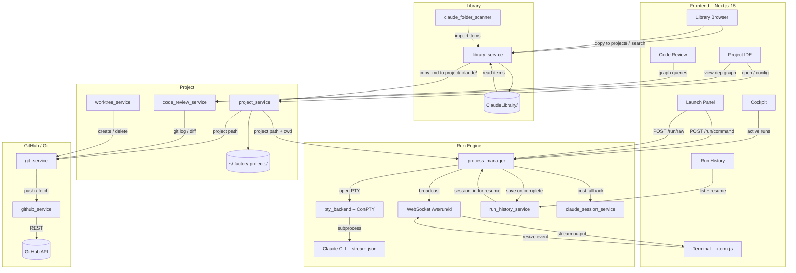

# Factory UI V2 — Architecture Specification

**Status**: Final
**Date**: 2026-03-28
**Scope**: Full rewrite from clean repo

**Related specs**:
- `v2-launch-panel-ux.md` — Launch panel UX detail (command input, autocomplete, controls)
- `DESIGN.md` — Complete design system (at project root)

---

## Feature Brief

| Field | Value |
|---|---|
| **Feature name** | Factory UI V2 |
| **Persona** | Solo power user running Claude Code against multiple projects, from desktop or phone on local WiFi |
| **Problem** | V1 accumulated too many half-baked features (grader, optimizer, pipelines, workspace) that buried the core value: running Claude Code commands and reviewing what changed |
| **Solution** | Focused rewrite keeping only proven high-value features (run execution, git/worktrees, code review, run history, simplified library). Remove everything else. Start clean. |
| **Out of scope** | Auth, grader, optimizer, pipelines, global workspace, project workspace (tasks/notes), GitLab, email/SMTP, multi-user, cloud sync |

---

## What Gets Cut

| Removed | Reason |
|---|---|
| Auth (`auth.py`, `auth_service`, JWT, bcrypt) | Single-user local tool — zero need |
| Grader (3 services, 10 components) | Half-baked, rarely used |
| Optimizer (mutation engine, sessions) | Not enough standalone value |
| Pipelines (sequential run chaining) | Not core to V2 |
| Global Workspace (kanban, bookmarks) | Overhead, not workflow-focused |
| Project Workspace (tasks, notes, pinned files) | Noise, not core |
| GitLab service | Not needed — GitHub is sufficient |
| Email service (SMTP, notifications) | N/A without multi-user |
| Batch launch | Removed — not core |
| Library folders, packages, subcategories | Replaced by flat items + tags |

---

## What Carries Over (proven, keep)

| Feature | Notes |
|---|---|
| PTY execution model | ConPTY + stream-json + WebSocket per run — unchanged |
| Run History | Persist, query, resume |
| Git service + Worktrees UI | Keep, improve UX |
| GitHub service | Keep — PR creation, repo linking, remote ops |
| Code Review (dep graph) | Keep, switch from D3 iframe to ReactFlow |
| Claude Import | Redesign the UX, keep the scanner logic |
| Library | Full redesign: flat items + tags, no folders/packages |

---

## Component Interaction Map



Key change from V1: **No file_provisioner in the run launch path.** Commands must already exist in `project/.claude/`. The library's "Copy to project" action (via `library_service`) handles installing items before the user launches a run.

---

## Backend V2

### Routers (10, down from 17)

| Router | File | Key Endpoints |
|---|---|---|
| `projects.py` | Projects CRUD | list, create, validate-path, browse, discover, generate-claude-md, file-tree, file read/write |
| `run.py` | Launch runs | POST command, POST raw, POST resume, POST cancel |
| `runs.py` | Run history | GET list, GET single, GET output, DELETE |
| `library.py` | Library CRUD | list, get, create, update, delete, tags, copy-to-project |
| `claude_import.py` | Import | POST scan, POST import |
| `code_review.py` | Dep graph | GET stats, POST build, POST graph-data, POST impact, GET nodes |
| `git.py` | Git ops | status, diff, stage, unstage, commit, discard, log, merge |
| `worktrees.py` | Worktrees | list, create, delete, branches |
| `github.py` | GitHub | token CRUD, remote info, push, PR create/list |
| `settings.py` | Settings | GET, PATCH |

### Services (14, down from 35+)

```
backend/services/
    process_manager.py       # PTY process lifecycle + WS streaming + prompt detection
    pty_backend.py           # ConPTY (Windows) / pty (Unix) implementation
    project_service.py       # Project registry (flat JSON), file tree, file read/write
    run_history_service.py   # Persist + query run history
    run_output_service.py    # Store + serve PTY output (gzipped, capped 2MB)
    library_service.py       # V2 flat items + tags + copy-to-project
    claude_folder_scanner.py # Scan .claude/ for import preview
    claude_session_service.py# Parse session files for cost/token recovery
    claude_cli.py            # CLI invocation helpers (build command, clean env)
    git_service.py           # Commit, diff, branch, status, merge, revert
    worktree_service.py      # Worktree create/delete/list
    github_service.py        # GitHub API -- PRs, push, repo linking
    code_review_service.py   # Dep graph (code-review-graph library wrapper)
    settings_service.py      # Read/write ~/.factory-cli.json (no auth)
```

### Tech Stack

```
fastapi
uvicorn[standard]
websockets
pydantic>=2.0
httpx                # GitHub API calls
pywinpty             # Windows ConPTY
code-review-graph    # Dependency graph builder
```

Removed from V1: `python-jose`, `bcrypt`, `aiosmtplib` (no auth, no email).

---

## Frontend V2

### Routes (9, down from 14+)

```
app/(app)/
    page.tsx                      # Cockpit -- active runs, recent projects
    projects/
        page.tsx                  # Projects browser
        new/page.tsx              # Create project wizard
        [id]/
            page.tsx              # Project IDE (main work area)
            review/page.tsx       # Code review graph (full-screen)
    runs/
        page.tsx                  # Run history
        [run_id]/page.tsx         # Run terminal viewer
    library/page.tsx              # Library browser
    settings/page.tsx             # Settings
```

No auth pages (`/login`, `/setup`). No grader, optimizer, pipelines, or workspace pages.

### Component Groups (~55, down from 130+)

```
components/
    shell/       # AppShell, Sidebar, BottomNav, TopBar, Breadcrumb,
                 # GlobalSearchModal, KeyboardShortcutsOverlay, ToastRegion,
                 # ActiveRunsWidget
    cockpit/     # ActiveRunsSection, RecentProjectsSection, ProjectCard,
                 # RecentRunsSection
    project/     # RunNavigator, RunGroupHeader, RunCard, FileTree,
                 # ProjectOverview, LaunchTab, CommandInput, CommandAutocomplete,
                 # BranchesTab, WorktreeCard, MergePanel, GitPanel, GitFileList,
                 # GitFileRow, InlineDiffViewer, CommitForm, RecentCommits,
                 # WorktreesPanel, CreateWorktreeForm, DeleteWorktreeDialog,
                 # EditorPanel, ProjectSettings
    terminal/    # TerminalPane, RawTerminalPane, RunHeader, PhaseBar,
                 # AwaitingInputBadge
    library/     # LibraryGrid, LibraryItemCard, LibraryFilters,
                 # LibraryItemModal, LibraryItemForm, TagPill, TypeBadge,
                 # ImportWizard, ImportStep1, ImportStep2, ImportStep3
    runs/        # RunsTable, RunStatusBadge, RunFilters, RunDetailsPanel,
                 # TerminalReplay
    code-review/ # DependencyGraph, GraphControls, GraphNode,
                 # NodeDetailPanel, BuildGraphCTA
    settings/    # SettingsForm, GitHubSettings, PricingTable
```

### Tech Stack

```json
{
  "next": "15",
  "react": "19",
  "tailwindcss": "^4",
  "@xterm/xterm": "terminal emulation",
  "@xyflow/react": "graph visualization (code review)",
  "dagre": "graph layout",
  "zustand": "UI state management",
  "@tanstack/react-query": "server state + caching",
  "react-hook-form": "form management",
  "zod": "validation (import from 'zod/v4')",
  "@codemirror/view": "code editor",
  "lucide-react": "icons"
}
```

---

## Library V2 -- The Key Redesign

### V1 Problem

6 organizational layers: packages -> folders -> subcategories -> items + usage stats + built-in overrides. Impossible to navigate.

### V2 Model: Flat Items + Tags

```typescript
interface LibraryItem {
  id: string
  name: string
  type: "command" | "workflow" | "skill" | "agent" | "claude-md"
  source: "builtin" | "user" | "imported"
  description: string
  content: string           // raw markdown / file content
  tags: string[]            // user-assigned, free-form
  imported_from?: string    // original .claude/ path, if imported
  created_at: string
  updated_at: string
}
```

### Storage

```
ClaudeLibrairy/
    _index.json        # [{id, name, type, source, tags, description}]
    items/
        [id].json      # Full item including content
```

No packages. No folders. No subcategories. **Search + tag filter is the navigation.**

### Copy to Project

Instead of V1's file provisioner (which copied items at run launch time), V2 has an explicit "Copy to project" action in the library. This copies the item's `.md` file to `project/.claude/{type}s/{stem}.md`. The user must do this before launching a command — the launch panel only shows commands already installed in the project.

### Import Flow (Claude Import Redesign)

1. User picks a directory (or project path)
2. Scanner finds all `.claude/commands/`, `.claude/agents/`, `.claude/skills/` etc.
3. Flat preview list: name, type, first line of content
4. User checks which items to import
5. Selected items land in library with `source: "imported"`, `imported_from: "/path/..."`

---

## Storage Layout

```
~/.factory-cli.json              # Global settings (no auth section in V2)
~/.factory-cli-projects.json     # Project registry (flat JSON array)
~/.factory-projects/             # Per-project data
    {project_id}/
        config.json              # Project config (default effort, skip permissions)
        worktrees.json           # Worktree registry
        runs/
            {run_id}.json        # Run metadata
            {run_id}.output.gz   # PTY output (gzipped, capped 2MB)
            _index.json          # Run list index for fast queries
ClaudeLibrairy/                  # Library (flat schema)
    _index.json                  # Item summaries
    items/
        {id}.json                # Full items with content
```

Removed from V1: workspace.json, global workspace, pipeline definitions, grader/optimizer data, auth credentials in settings, builtin overrides file.

---

## Data Flow: Core Run Execution

```
User types "/polisher src/components/" and clicks [Run]
  -> Frontend: POST /api/run/command { project_id, stem: "polisher", args: "src/components/" }
  -> Backend: validate stem exists in project/.claude/commands/polisher.md
  -> Backend: process_manager.spawn_run(run_id, cwd)
       -> Build command: claude --print --output-format stream-json --verbose "/polisher src/components/"
       -> Open PTY (ConPTY on Windows, pty on Unix)
       -> Status: pending -> active
       -> Inject /rename {session_name} (for resume support)
       -> Inject /effort {level} (if effort != auto)
       -> Background thread: read PTY bytes -> broadcast to WebSocket subscribers
  -> Frontend: connect WebSocket /ws/run/{run_id}
       -> Receive pty_output (base64) -> decode -> xterm.js.write()
       -> Receive phase_update -> update PhaseBar ("Writing: src/auth.ts")
       -> Receive awaiting_input_update -> update RunCard (amber badge)
       -> Receive cost_update -> update RunHeader ($0.06)
       -> Receive status_update (completed) -> run done
  -> Backend: run_history_service.save(run) on completion
  -> Backend: run_output_service.finalize(run_id) -> gzip PTY buffer to .output.gz
```

---

## Error Handling Strategy

### Standard Error Response

All API errors return:
```json
{
  "detail": "Human-readable error message",
  "code": "machine_readable_error_code"
}
```

HTTP status codes: 400 (validation), 404 (not found), 409 (conflict), 500 (server error).

### Frontend Error Handling

- **TanStack Query `onError`**: mutations show error toast with `detail` message
- **Query errors**: components render error state with retry button
- **Network failures**: TanStack Query retries with exponential backoff (3 attempts, 1s/2s/4s)
- **Error boundaries**: per-page React error boundary catches render errors, shows "Something went wrong" with retry

### WebSocket Reconnection

- On disconnect: attempt reconnect with exponential backoff (1s, 2s, 4s, 8s, 16s)
- Max 5 reconnect attempts
- On reconnect: server replays last ~500KB of PTY output buffer
- During reconnect: show "Reconnecting..." overlay on the terminal
- After max retries: show "Connection lost. [Retry]" button
- Multiple tabs: each tab opens its own WS connection — all receive same data

### Process Errors

- Claude CLI not on PATH: run fails immediately with `error_message: "Claude CLI not found"`
- PTY spawn failure: run fails with `error_message` from the exception
- Process crash: PTY read loop detects EOF, sets status to `failed`, extracts error from last 100 lines of output

---

## Responsive / Mobile (local WiFi)

- Sidebar collapses to icons on `< 768px`, hidden with bottom nav on `< 640px`
- Bottom navigation: Cockpit | Projects | Runs | Library
- Project IDE panels stack vertically on mobile
- Terminal: xterm.js with touch scrolling, `fontSize: 12` on mobile
- No separate mobile app — responsive layout only

---

## Validation Patterns

| Entity | Pattern | Max Length |
|---|---|---|
| Run ID | `^[a-zA-Z0-9_\-]{1,64}$` | 64 |
| Project ID | `^[a-zA-Z0-9_-]{1,64}$` | 64 |
| Branch name | `^[a-zA-Z0-9][a-zA-Z0-9/_.\-]{0,199}$` | 200 |
| Session ID (UUID) | `^[0-9a-f]{8}-...-[0-9a-f]{12}$` | 36 |
| Session name | `^[a-zA-Z0-9][a-zA-Z0-9_\-]{0,127}$` | 128 |
| Model name | `^[a-zA-Z0-9][a-zA-Z0-9._-]{0,99}$` | 100 |

---

## Acceptance Criteria

### Run Execution
- Given a project is selected, When I submit `/cmd args`, Then a run starts and streams output via WebSocket to xterm.js
- Given a run completes, Then cost, tokens, duration are displayed
- Given a past run, Then I can resume it with `--resume [session_id]`

### Library
- Given the library page, When I search or filter by tag/type, Then results update instantly
- Given the import wizard, When I point to a `.claude/` folder, Then I see a flat preview of discoverable items
- Given an item, When I click "Copy to project", Then its `.md` file is copied to the project's `.claude/` directory

### Git / Worktrees
- Given a project, When I view the git panel, Then I see current diff, staged files, and commit controls
- Given a project, When I create a worktree, Then it is available as a target in the launch panel

### Code Review
- Given a project, When I open Code Review, Then the dependency graph renders with all modules
- Given a node, When I click it, Then I see its imports/dependents and blast radius

### Error Handling
- Given a network failure on an API call, Then retry logic activates with exponential backoff
- Given a WebSocket disconnects, Then reconnection attempts start automatically with replay on success
- Given Claude CLI is not installed, Then the run fails with a clear error message

### Mobile
- Given a screen < 640px, Then bottom navigation is visible and sidebar is hidden
- Given the terminal on mobile, Then it is scrollable with touch

---

## Migration Notes (V1 -> V2)

Since V2 is a **clean repo**, there is no automated migration. Manual steps:
1. Copy `ClaudeLibrairy/` items — re-index into the new flat schema (remove folders, packages, subcategories)
2. Copy `~/.factory-cli-projects.json` — format is compatible
3. Copy `~/.factory-projects/` run history — format review needed (run type enum changed)
4. Copy `~/.factory-cli.json` — remove `auth` section, remove GitLab/SMTP fields
5. All grader/optimizer/pipeline/workspace data can be discarded
